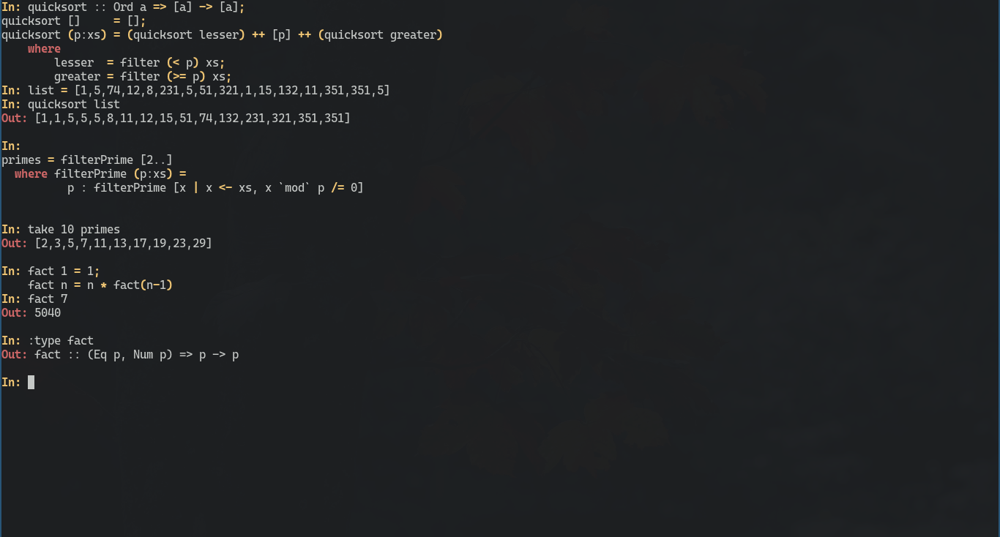

# IHsk
[Haskell](https://www.haskell.org/) and [Smlnj](https://www.smlnj.org/) Repl

By default it runs as a Haskell Repl

To run smlnj Repl run `ihsk smlnj`

# What/Why
This is a wrapper over ghci and smlnj.

It offers two things on top of ghci:
- colors
- Ctrl-s to create new line (useful with `;` to create multiline functions)

It offers different things on top of smlnj mainly:
- arrow keys actually work
- auto insert of `;`
- Ctlr-s to crate new lines
- simple tab autocompletion
- colors
